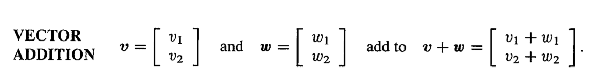
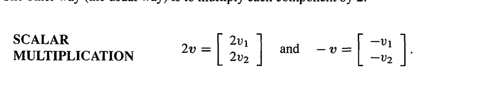
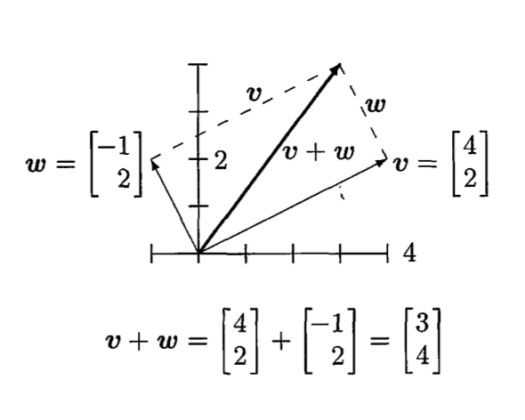
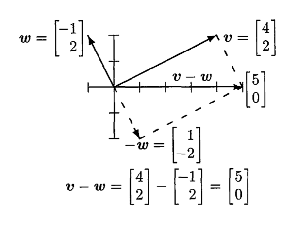

# Introduction to Vectors

A **vector** is an object that has both a magnitude and a directions.

_"You can't add apples and oranges"_ The reason for vectors are for this kind of situation. When we have two seperate variables _v1_ and _v2_, the pair productes a two-dimensional vector _v_:

## Vectors and Linear Combinations

The sum of two vectors with scalar multiplication, _cv_ and _dw_, is a **linear combination** of _v_ and _w_

We can visualize vectors by using arrows, where _v1_ = 4 units to the right and _v2_ = 2 units up. It ends at the point whose _x,y_ coordinates are (4,2)

More exmaples

**Vectors**

## Length and Dot Products

## Matrices

## How are they used in Machine Learning?
