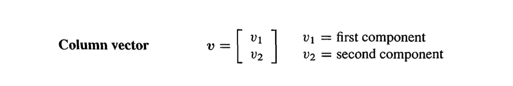

# Introduction to Vectors

A vector is an object that has both a magnitude and a directions. When we have two seperate variables _v1_ and _v2_, the pair productes a two-dimensional vector _v_:

## Vectors and Linear Combinations

## Length and Dot Products

## Matrices

## How are they used in Machine Learning?
