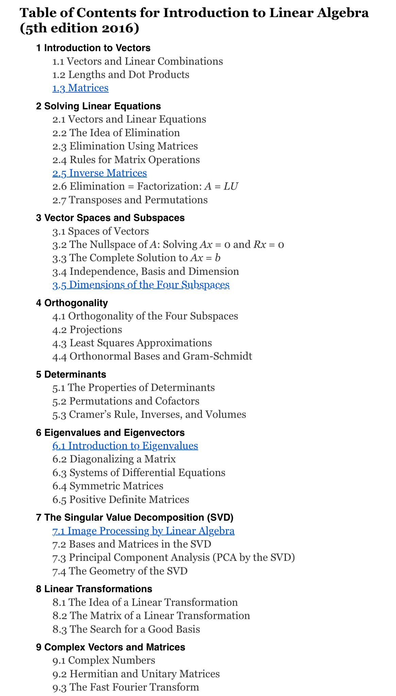

# Linear-Algebra

# This repo is a refresher about Linear Algebra needed for AI/ML engineering roadmap

# Content in this repo

## Checklist

- [] Introductions to Vectors
- [] Solving Linear Equations
- [] Vector Spaces and Subspaces
- [] Orthogonality
- [] Determinants
- [] Eigenvalues and Eigenvectors
- [] The Singular Value Decomposition(SVD)
- [] Linear Transformation
- [] Complex Vectors and Matrices
